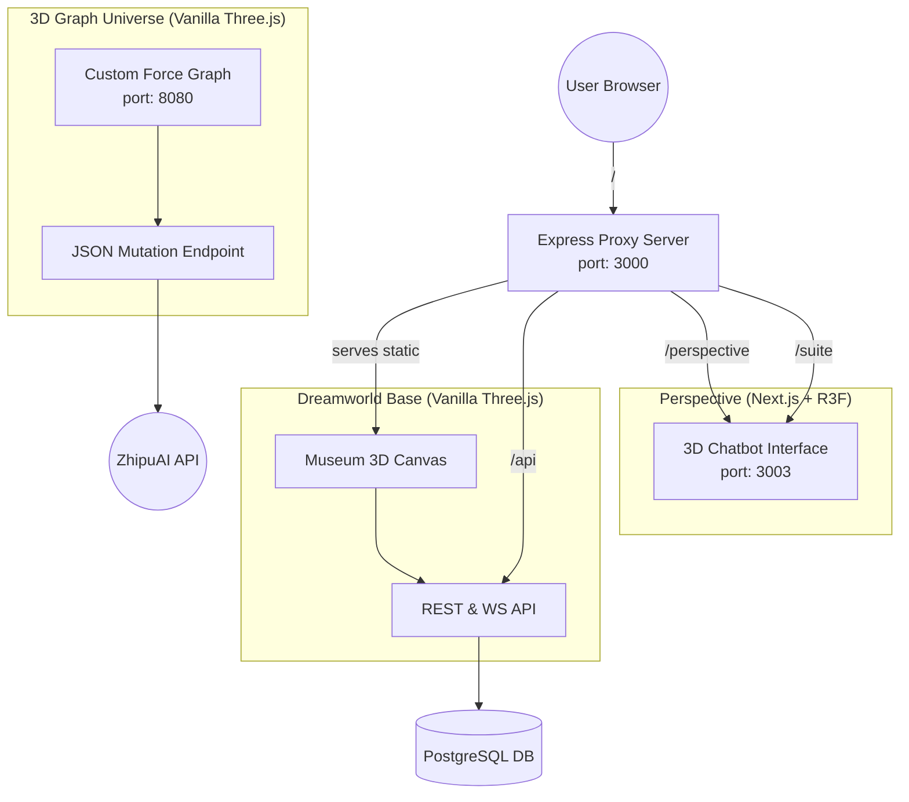

# Dreamworld Codebase & Hackathon Rebuild Analysis

## 1. Executive Summary
You have built a sophisticated multi-application ecosystem masking as a single platform. The "Dreamworld" experience is actually three distinct services—a 3D Museum (Vanilla JS/Three.js), a Graph Visualizer (Custom Three.js physics), and an AI Chatbot (Next.js/React Three Fiber)—orchestrated behind an Express proxy. 

**What you built**:
- A custom 3D force-directed physics engine (`3dGraphUniverse`) that is entirely original and mathematically complex.
- A sophisticated AI architecture that parses ZhipuAI LLM outputs into JSON to organically mutate the 3D graph state.
- A functional 3D multi-user backend (Express/Postgres/WebSockets) for spawning and persisting objects.

**What is reusable (Concepts & Patterns)**:
- **The AI Mutation Architecture**: The prompt engineering and parsing logic that turns text into 3D state changes is your most valuable asset. Keep the backend API layer.
- **The System/World Pattern**: Your separation of rendering logic (systems) from state logic (world) is excellent and maps perfectly to React frameworks.
- **The Open Source Libraries**: You rely on MIT-licensed tools (Three.js, Express, Next.js). Everything else is yours.

**The Hackathon Pivot**:
Because you are adding E-commerce and Solana checkout to a 48-hour deadline, **you must abandon the Vanilla JS architecture**. Rebuild everything inside a unified **Next.js + React Three Fiber (R3F)** app. Do not rewrite your custom physics engine under a time crunch; use `react-force-graph-3d` to save 10+ hours.

---

## 2. Visual Dependency Graph

---

## 3. Detailed Component Breakdown & Originality

| Component | Files Involved | Originality | Rebuild Strategy |
| :--- | :--- | :--- | :--- |
| **3D Museum Setup** | `systems/camera.js`, `renderer.js`, [Museum.js](file:///root/everything/dreamworld/src/world/Museum.js) | **Boilerplate** (Tutorial Code) | Use R3F `<Canvas>`, `<PerspectiveCamera>`, and Drei templates. Do not rewrite manually. |
| **First Person Controls** | `systems/controls.js` | **Library** (`camera-controls`) | Use Drei's `<PointerLockControls>` or `<OrbitControls>`. |
| **Postgres Database API** | [server/routes/api.js](file:///root/everything/dreamworld/server/routes/api.js) | **Boilerplate** | Use a BaaS like **Supabase**. Do not waste time writing SQL tables and JWT auth handlers in a hackathon. |
| **AI Prompt to JSON** | [3dGraphUniverse/server.js](file:///root/everything/3dGraphUniverse/server.js) | **Highly Original** | Keep the exact prompts and parsing logic. Port the Express endpoint directly into Next.js Route Handlers. |
| **Force Graph Engine** | `src/physics.js`, `nodes.js` | **Highly Original (Complex)** | Adapting this custom math to React state will take too long. Swap to `react-force-graph-3d`. |
| **Object Placement** | `systems/Editor.js` | **Original** (Medium) | Rewrite using Drei's `<TransformControls>`. |
| **Chatbot Frontend** | `perspective2/src/` | **Library-Heavy** | Re-use entirely. It's already in Next.js/R3F, which matches the target hackathon architecture. |

---

## 4. Hackathon Rebuild Roadmap (48 Hours)

Follow this order strictly to ensure you hit the Solana E-commerce requirements without getting bogged down recreating your old Vanilla JS architecture.

### [ ] Phase 1: The Foundation (Hours 0-6)
1. Initialize unified Next.js + React Three Fiber workspace.
2. Hook up Supabase for instant Authentication and Postgres object persistence.
3. Establish global state management using Zustand (vital for bridging React UI with 3D Canvas).

### [ ] Phase 2: Core 3D & E-Commerce (Hours 6-18)
1. Recreate Museum floor/walls using R3F standard meshes.
2. Build 2D DOM overlays (HTML mapped over 3D) for the E-commerce product templates.
3. Integrate Solana wallet adapter functionality into the 2D overlays.

### [ ] Phase 3: The AI & Graph Integration (Hours 18-32)
1. Port your ZhipuAI Endpoint into a Next.js App Router API route (`/api/chat`).
2. Implement your Chatbot UI panel (porting from `perspective2`).
3. Render the Graph Visualizer using `react-force-graph-3d`, passing the AI's JSON mutations into the Zustand store to update the graph reactively.

### [ ] Phase 4: Placement & Polish (Hours 32-48)
1. Rewrite `Editor.js` using R3F `<TransformControls>` to allow users to place their Solana products in the 3D space.
2. Verify multiplayer sync (if needed) using Supabase Realtime instead of raw WebSockets.
3. UI Polish, ambient lighting, and shader restoration.

---

## 5. Time Estimates for Rebuild Tasks

| Task | Estimated Time | Complexity |
| :--- | :--- | :--- |
| **Next.js + R3F Setup** | 2 hours | Simple |
| **Auth & DB (Supabase)** | 3 hours | Simple |
| **Solana Wallet Integration** | 5 hours | Medium |
| **3D Scene Architecture** | 4 hours | Simple |
| **E-Commerce Templates (UI)** | 6 hours | Medium |
| **AI prompt/API Porting** | 3 hours | Simple |
| **Chatbot Interface** | 4 hours | Medium |
| **Graph Visualizer (Library)**| 4 hours | Medium |
| **Object Placement Logic** | 5 hours | Complex |
| **Buffer & Integration Testing**| 12 hours | - |
| **Total Estimated Time** | **48 Hours** | - |

---

## 6. Risk Assessment (The "What Might Break" Guide)

> [!CAUTION]
> **Risk 1: State Synchronization (High Risk)**
> Connecting React State (Zustand) to Three.js imperative objects is tricky. If you try to manually `.position.set()` inside React, you will lose data. **Mitigation:** Use R3F perfectly. The hook `useFrame` and Zustand are your best friends.

> [!WARNING]
> **Risk 2: Rebuilding Custom Physics (High Risk)**
> You spent dozens of hours on `physics.js` in Graph Universe. Rebuilding it in R3F will eat 24+ hours of your hackathon. **Mitigation:** Rely on `react-force-graph-3d`. It is the only way to meet your deadline.

> [!IMPORTANT]
> **Risk 3: AI Output Formatting (Medium Risk)**
> Your LLM integration depends on the model outputting perfect JSON blocks to mutate the graph. If it hallucinates, the UI breaks. **Mitigation:** Add rigid fallback parsers or switch completely to OpenAI's new `Structured Outputs` feature to guarantee flawless JSON.

> [!NOTE]
> **Risk 4: Express to Next.js API Routes (Low Risk)**
> Next.js Server Actions and API routes behave slightly differently than Express regarding request bodies. **Mitigation:** Use standard NextRequest parsers and avoid trying to run long-lived WebSockets inside Next.js API routes; rely on Supabase Realtime or Pusher for live sync.

---

## Specific Questions Answered Summarized:

1. **How much is standard?** ~70% of the Vanilla code is boilerplate docs material. Your actual logic lies in the physics and AI parsing.
2. **Critical dependencies?** ZhipuAI API (make sure keys are funded/active) and Postgres (use Supabase).
3. **Most complex original code?** `3dGraphUniverse/src/physics.js`. Skip rewriting this.
4. **Blueprint reuse?** Yes, your conceptual separation of "Systems", "Managers", and "World" is identical to how R3F isolates logic into components.
5. **IP Concerns?** None. It's all your code running top of MIT frameworks.
6. **Percentage Mine?** You built roughly 80% custom logic on the Graph Universe side, but the wrapper is heavily boilerplate. You genuinely built the hard parts—the math and the LLM parsers.
